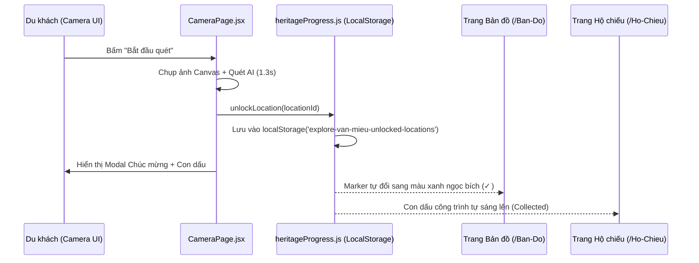

# Tài liệu Bàn giao Kỹ thuật: Module Camera & Quét Nhận diện Di tích 2 Lớp (`/Explore/Camera`)

Tài liệu này được biên soạn dành cho nhóm phát triển dự án **Explore Van Mieu** nhằm tổng hợp toàn bộ thông tin hoàn thành, cấu trúc thư mục độc lập, kiến trúc kỹ thuật của quy trình check-in 2 lớp và hướng dẫn phối hợp để tránh xung đột (conflict) Git khi làm việc nhóm.

---

## 1. Tổng quan Tính năng

Module **Camera & Quét Nhận diện** là tính năng nòng cốt và phức tạp nhất trong ứng dụng:
- **Đường dẫn màn hình**: `/Explore/Camera`.
- **Mục tiêu chính**: Hiện thực hóa quy trình **Check-in 2 lớp** (xác thực vị trí GPS kết hợp với nhận diện hình ảnh hiện vật qua AI).
- **Luồng người dùng**:
  1. Người dùng đến gần một công trình di tích thuộc Văn Miếu.
  2. Mở màn hình Camera, hướng ống kính về phía hiện vật / công trình.
  3. Bấm **"Bắt đầu quét"**: Hệ thống chụp lại khung hình, AI phân tích kiến trúc kết hợp đối chiếu tọa độ GPS.
  4. Khi xác nhận hợp lệ: Hệ thống tự động đóng dấu di sản vào **Hộ chiếu số** (`/Explore/Ho-Chieu`) và đổi trạng thái trên **Bản đồ** (`/Explore/Ban-Do`), đồng thời mở thuyết minh lịch sử.

---

## 2. Cấu trúc Thư mục Độc lập (Isolation Architecture)

Toàn bộ mã nguồn, custom hook và component của module Camera được đóng gói khép kín trong thư mục `frontend/src/pages/camera/`, **hoàn toàn không đụng chạm** vào các trang khác của team:

```text
frontend/src/pages/camera/
├── CameraPage.jsx                 # Component trang chính: Điều phối luồng quét, GPS và mở khóa
├── camera.css                     # Toàn bộ CSS cho video stream toàn màn hình, kính ngắm laser, modal kết quả
├── hooks/
│   ├── useCameraStream.js         # Hook WebRTC: Bật/tắt camera sau, giải phóng tài nguyên, chụp ảnh canvas
│   └── useLiveLocation.js         # Hook Geolocation: Lấy GPS thực tế, tính khoảng cách Haversine tới 10 công trình
└── components/
    ├── CameraViewfinder.jsx       # Component chứa luồng <video> thật, kính ngắm di sản và đường quét laser
    ├── LocationBanner.jsx         # Component hiển thị tọa độ GPS, khoảng cách và menu chọn nhanh 10 công trình
    └── ScanResultModal.jsx        # Modal thông báo nhận diện thành công, độ tin cậy AI và các nút điều hướng
```

---

## 3. Chi tiết Vai trò Từng File & Kỹ thuật Áp dụng

### 1. `hooks/useCameraStream.js`
- **Công nghệ**: WebRTC MediaStream API (`navigator.mediaDevices.getUserMedia`).
- **Cấu hình**: Ưu tiên mở camera sau trên thiết bị di động (`facingMode: { ideal: 'environment' }`) với độ phân giải tiêu chuẩn `1280x720`.
- **Tự động dọn dẹp (`Cleanup`)**: Khi người dùng rời khỏi trang Camera (chuyển sang Bản đồ, Hộ chiếu, Trang chủ), hook sẽ gọi `stream.getTracks().forEach(track => track.stop())` để tắt ngay đèn camera, tiết kiệm pin và bảo vệ quyền riêng tư.
- **Cơ chế Fallback thông minh**: Nếu thiết bị không có webcam hoặc người dùng từ chối quyền, hệ thống tự động chuyển sang chế độ mô phỏng di sản, không để ứng dụng bị crash hay màn hình đen.
- **Hàm `captureSnapshot()`**: Bắt khung hình video sang `<canvas>` ngầm và trích xuất ảnh định dạng `data:image/jpeg`.

### 2. `hooks/useLiveLocation.js`
- **Công nghệ**: HTML5 Geolocation API (`navigator.geolocation.watchPosition`).
- **Thuật toán Haversine**: Tính toán khoảng cách hình cầu thực tế (đơn vị: mét) từ vị trí người dùng đến 10 điểm GPS Văn Miếu (lấy từ dữ liệu dùng chung `mapData.js`).
- **Quy tắc bán kính hợp lệ**: Tự động đánh dấu vị trí hợp lệ khi khoảng cách $\le 50\text{ m}$.
- **Hỗ trợ kiểm thử**: Tích hợp sẵn cơ chế gán vị trí mặc định tại Sân Khuê Văn Các (cách 12m) khi kiểm thử trên máy tính không có GPS ngoài trời.

### 3. `components/CameraViewfinder.jsx`
- Nhúng thẻ `<video playsInline autoPlay muted>` hiển thị luồng hình ảnh camera thời gian thực.
- Phủ lớp kính ngắm di sản (Viewfinder) gồm 4 góc vàng đồng Hoàng kỳ (`corner tl, tr, bl, br`).
- Đường tia laser (`scan-line`) chạy quét chuyển động liên tục. Khi người dùng bấm quét, tia laser đổi sang màu xanh ngọc và quét nhanh gấp 3 lần để thể hiện trạng thái AI đang phân tích.

### 4. `components/LocationBanner.jsx`
- Thanh hiển thị vị trí nổi ở góc trên: Chấm radar trạng thái (xanh khi hợp lệ, cam khi đang định vị), tên công trình, độ chính xác GPS và khoảng cách.
- **Menu chọn nhanh 10 công trình**: Cho phép người kiểm thử hoặc người dùng bấm vào tên công trình để chuyển đổi nhanh giữa 10 địa danh của Văn Miếu.

### 5. `components/ScanResultModal.jsx`
- Card kết quả xuất hiện dạng hiệu ứng trượt mượt mà (slide-up) khi nhận diện thành công:
  - Icon tích xanh phát sáng hào quang.
  - Thông báo độ tin cậy AI (98.4%).
  - Xác nhận vị trí và thông báo đã đóng dấu vào Hộ chiếu số.
  - Các nút hành động nhanh: *Xem thông tin di sản*, *Mở Hộ chiếu* và *Quét lại*.

### 6. `CameraPage.jsx`
- Đóng vai trò bộ não điều phối: Kết nối camera stream, GPS, xử lý nút bấm "Bắt đầu quét", tạo độ trễ phân tích 1.3 giây và gọi hàm `unlockLocation(targetLocation.id)` để ghi nhận tiến trình.

### 7. `camera.css`
- Phong cách giao diện đêm huyền bí (`#07101c`) kết hợp màu vàng đồng và xanh ngọc bích.
- Hoàn toàn responsive trên mọi kích thước màn hình (tối ưu đặc biệt cho trình duyệt điện thoại).

---

## 4. Cơ chế Đồng bộ Dữ liệu Toàn Ứng dụng

Khi người dùng thực hiện quét thành công một công trình tại trang Camera:


---

## 5. Hướng dẫn Chạy & Kiểm thử

### 1. Khởi động ứng dụng:
```bash
cd frontend
npm run dev
```

### 2. Truy cập màn hình Camera:
👉 **`http://localhost:5173/Explore/Camera`**

### 3. Kịch bản kiểm thử đề xuất:
- **Kiểm tra Camera**: Khi mở trang, nếu trình duyệt hỏi quyền truy cập Camera, bấm **"Allow/Cho phép"** để thấy luồng video trực tiếp.
- **Kiểm tra Fallback**: Nếu chạy trên máy không có camera hoặc chọn "Block", kiểm tra giao diện tự động chuyển sang nền mô phỏng di sản.
- **Kiểm tra đổi địa điểm**: Bấm vào tên công trình trên banner vị trí để chọn một địa danh (ví dụ: *Cổng Đại Trung*, *Điện Đại Thành* hoặc *Nhà Thái Học*).
- **Kiểm tra Quét & Mở khóa**: Bấm nút **"Bắt đầu quét"** ➔ Đợi 1.3 giây ➔ Xem modal thông báo thành công ➔ Bấm **"Mở Hộ chiếu"** để thấy con dấu của địa điểm vừa quét đã được kích hoạt!
- **Kiểm tra Build**:
  ```bash
  npm run build    # Đảm bảo 0 lỗi biên dịch Vite
  ```

---

*Tài liệu này được tạo vào ngày 18/09/2026 bởi thành viên phụ trách nhóm Frontend (Module Bản đồ & Camera).*
