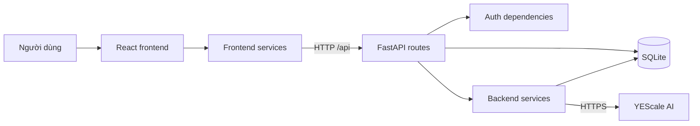
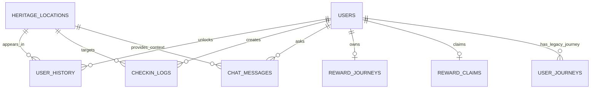

# Bản đồ đọc hiểu project Explore Van Mieu

Tài liệu này mô tả cấu trúc project theo trách nhiệm của từng phần. Các thư mục
phụ thuộc và file sinh tự động như `.venv`, `node_modules`, `dist` và
`__pycache__` không được đưa vào cây.

## 1. Kiến trúc tổng thể



Quy tắc dễ nhớ:

- `pages` và `components` hiển thị giao diện.
- `frontend/src/services` gọi API.
- `backend/src/routes` nhận API và điều phối nghiệp vụ.
- `backend/src/services` xử lý việc chuyên biệt như JWT, mật khẩu và AI.
- `backend/src/models` mô tả dữ liệu gửi nhận và các bảng database.
- `database` tạo bảng và thêm dữ liệu ban đầu.

## 2. Cây thư mục rút gọn

```text
Explore-VanMieu-Team/
├── .env                         # Bí mật và cấu hình máy cục bộ, không commit
├── README.md                    # Hướng dẫn chung
├── backend/
│   ├── requirements.txt         # Thư viện Python
│   ├── README.md                # Hướng dẫn backend và HTTPS
│   ├── src/
│   │   ├── app/
│   │   │   ├── main.py          # Ghép toàn bộ API router
│   │   │   └── web.py           # Chạy bản production gồm API + React build
│   │   ├── config/
│   │   │   └── db.py            # Tạo SQLModel engine, đọc DATABASE_URL
│   │   ├── dependencies/
│   │   │   └── auth.py          # Đọc JWT cookie và lấy người dùng hiện tại
│   │   ├── models/               # Bảng DB và schema request/response
│   │   ├── routes/               # Các endpoint /api/...
│   │   └── services/             # Nghiệp vụ dùng lại và kết nối AI
│   └── tests/
│       └── test_checkin_routes.py
├── database/
│   ├── explore_van_mieu.db       # SQLite cục bộ, không commit
│   ├── schema/init_db.py         # Tạo bảng
│   └── seeds/
│       ├── seed_locations.py     # Thêm 10 địa điểm
│       └── seed_demo_admin.py    # Tạo tài khoản admin phát triển
├── frontend/
│   ├── index.html                # HTML gốc chứa div#root
│   ├── package.json              # Thư viện và lệnh npm
│   ├── vite.config.js            # Vite, HTTPS và proxy /api
│   ├── public/images/            # Ảnh tĩnh
│   └── src/
│       ├── main.jsx              # Điểm bắt đầu React
│       ├── App.jsx               # Trạng thái toàn ứng dụng và chọn trang
│       ├── routes/index.js       # Ánh xạ URL sang page
│       ├── pages/                # Mỗi màn hình chính
│       ├── components/           # Thành phần dùng chung
│       ├── services/             # Hàm fetch gọi backend
│       ├── data/                 # Dữ liệu giao diện tĩnh
│       ├── i18n/                 # Hệ thống đa ngôn ngữ
│       ├── locales/              # vi.json và en.json
│       ├── store/                # Context trạng thái dùng chung
│       ├── utils/                # Xử lý response và ảnh
│       └── styles/               # CSS dùng chung
├── docs/                         # Tài liệu API và yêu cầu
└── reports/                      # Báo cáo kiểm tra/tối ưu
```

## 3. Frontend

### 3.1 Luồng khởi động

```text
frontend/index.html
  → src/main.jsx
  → LanguageProvider
  → App.jsx
  → routes/index.js
  → page tương ứng
```

`main.jsx` gắn React vào `div#root`, nạp CSS tổng và bọc ứng dụng bằng
`LanguageProvider`.

`App.jsx` là bộ điều phối frontend. File này giữ:

- `user`: tài khoản đang đăng nhập.
- `unlockedLocations`: tập các địa điểm đã mở khóa.
- `reward`: trạng thái phần thưởng.
- `pathname`: URL hiện tại.
- Các hàm đăng xuất, xác minh check-in và chuyển trang.

### 3.2 Các trang

| Thư mục | Vai trò |
| --- | --- |
| `pages/home` | Trang khám phá và giới thiệu hành trình. |
| `pages/map` | Bản đồ và địa điểm được chọn. |
| `pages/locations` | Danh sách công trình. |
| `pages/location-detail` | Chi tiết địa điểm và hộp hỏi đáp AI. |
| `pages/figures` | Danh sách danh nhân. |
| `pages/camera` | Camera, GPS, chụp ảnh và gửi check-in. |
| `pages/passport` | Hộ chiếu, con dấu và tiến độ. |
| `pages/account` | Tài khoản và lịch sử check-in. |
| `pages/register` | Đăng ký và đăng nhập. |

### 3.3 Component dùng chung

- `components/navigation`: menu và đổi ngôn ngữ.
- `components/map-view`: bản đồ Leaflet và sidebar địa điểm.
- `components/journey-card`: thẻ hành trình.
- `pages/location-detail/components/HeritageMessageBox.jsx`: hộp chat AI.
- `pages/account/components/CheckinHistory.jsx`: lịch sử check-in.
- `pages/camera/components`: khung camera và kết quả quét.

### 3.4 Service frontend

| Service | API gọi tới |
| --- | --- |
| `auth-service` | đăng ký, đăng nhập, `/me`, đăng xuất |
| `passport-service` | `/api/progress` |
| `check-in-service` | xác minh và lịch sử check-in |
| `chat-service` | gửi câu hỏi và tải lịch sử chat |
| `reward-service` | xem và nhận phần thưởng |

Các page không nên tự lặp lại `fetch`. Page gọi service, service xử lý HTTP rồi
trả dữ liệu cho page.

## 4. Backend

### 4.1 Entry point

`backend/src/app/main.py` tạo FastAPI, cấu hình CORS, tắt cache cho `/api` và
đăng ký tất cả router.

`backend/src/app/web.py` dùng khi chạy production. Nó phục vụ cả API lẫn thư mục
`frontend/dist` từ cùng một origin.

### 4.2 API routes

| File | Prefix | Trách nhiệm |
| --- | --- | --- |
| `routes/auth.py` | `/api/auth` | Đăng ký, đăng nhập, đọc tài khoản, đăng xuất. |
| `routes/locations.py` | `/api/locations` | Danh sách địa điểm và đồng bộ mở khóa. |
| `routes/progress.py` | `/api/progress` | Tiến độ của tài khoản hiện tại. |
| `routes/checkins.py` | `/api/checkins` | Xác minh GPS + ảnh và lịch sử check-in. |
| `routes/chat.py` | `/api/chat` | Hỏi đáp AI và lịch sử hội thoại. |
| `routes/target.py` | `/api/target` | Địa điểm mục tiêu được giao cho tài khoản. |
| `routes/rewards.py` | `/api/rewards` | Xem và nhận phần thưởng. |
| `routes/journey.py` | `/api/journey` | Dữ liệu hành trình kiểu cũ. |

### 4.3 Services backend

| File | Vai trò |
| --- | --- |
| `passwords.py` | Hash và kiểm tra mật khẩu bằng Argon2. |
| `tokens.py` | Tạo và giải mã JWT hết hạn sau 24 giờ. |
| `targets.py` | Gán mục tiêu ngẫu nhiên và nâng cấp cột user cũ. |
| `image_processing.py` | Kiểm tra, xoay và thu nhỏ ảnh trước khi gửi AI. |
| `vision.py` | Gửi ảnh đến YEScale và chuẩn hóa kết quả nhận diện. |
| `chat.py` | Gửi ngữ cảnh lịch sử đến YEScale để trả lời câu hỏi. |

`dependencies/auth.py` là chốt bảo vệ API. Nó lấy cookie `session`, giải mã JWT,
tìm `User` trong database và trả lỗi `401` nếu phiên không hợp lệ.

## 5. Database



| Model | Bảng | Ý nghĩa |
| --- | --- | --- |
| `User` | `users` | Tài khoản, quyền admin, target và dữ liệu mở khóa tương thích. |
| `HeritageLocation` | `heritage_locations` | Tọa độ, nhãn AI và nội dung địa điểm. |
| `UserHistory` | `user_history` | Quan hệ mở khóa giữa user và location. |
| `CheckinLog` | `checkin_logs` | Mọi lần xác minh, kể cả thành công và thất bại. |
| `ChatMessage` | `chat_messages` | Câu hỏi và câu trả lời AI theo user/location. |
| `RewardJourney` | `reward_journeys` | Danh sách mục tiêu cho phần thưởng. |
| `RewardClaim` | `reward_claims` | Phần thưởng người dùng đã nhận. |
| `UserJourney` | `user_journeys` | Cấu trúc hành trình cũ còn giữ để tương thích. |

`UserHistory` dùng khóa chính ghép `(user_id, location_id)`, vì mỗi người chỉ có
một trạng thái mở khóa cho mỗi địa điểm.

## 6. Các luồng nghiệp vụ quan trọng

### 6.1 Đăng nhập

```text
RegisterPage
  → auth-service.login()
  → POST /api/auth/login
  → kiểm tra password hash
  → tạo JWT
  → lưu JWT vào cookie HttpOnly session
  → App gọi GET /api/auth/me khi tải lại trang
```

### 6.2 Check-in

```text
CameraPage
  → useCameraStream lấy ảnh
  → useLiveLocation lấy GPS
  → check-in-service.verifyCheckin()
  → POST /api/checkins/verify
  → tìm địa điểm gần nhất
  → vision.py gửi ảnh đến YEScale
  → so sánh GPS + nhãn + confidence
  → ghi checkin_logs
  → nếu đạt: ghi user_history
  → frontend cập nhật hộ chiếu và phần thưởng
```

### 6.3 Hỏi đáp AI

```text
HeritageMessageBox
  → chat-service
  → POST /api/chat
  → kiểm tra user đã mở khóa địa điểm
  → lấy story_summary + deep_history
  → chat.py gọi YEScale
  → lưu chat_messages
  → trả câu trả lời cho frontend
```

### 6.4 Lịch sử check-in

```text
AccountPage
  → CheckinHistory
  → GET /api/checkins/history
  → lọc CheckinLog theo current_user
  → nối HeritageLocation để lấy tên
  → sắp xếp mới nhất trước
```

## 7. Thứ tự đọc project đề xuất

1. `README.md`: biết cách chạy và chức năng tổng quát.
2. `frontend/src/main.jsx`: xem React bắt đầu ở đâu.
3. `frontend/src/App.jsx`: hiểu trạng thái chung và cách chọn trang.
4. `frontend/src/routes/index.js`: biết URL nào mở page nào.
5. Chọn một page, ví dụ `pages/register/RegisterPage.jsx`.
6. Theo import từ page sang service tương ứng.
7. Từ URL trong service tìm route backend tương ứng.
8. Từ route theo tiếp sang dependency, service và model.
9. Đọc `database/schema/init_db.py` và seed để hiểu dữ liệu ban đầu.

Không nên đọc tuần tự tất cả file. Hãy theo một luồng dọc hoàn chỉnh, ví dụ
đăng nhập hoặc check-in, từ giao diện đến database rồi mới chuyển sang chức năng
khác.

## 8. File sinh tự động và file riêng tư

- `.env`: chứa secret, không commit.
- `database/*.db`: dữ liệu SQLite của từng máy, không commit.
- `backend/.venv`: thư viện Python cục bộ.
- `frontend/node_modules`: thư viện JavaScript cục bộ.
- `frontend/dist`: kết quả build, có thể tạo lại.
- `__pycache__`: cache Python, có thể xóa và tạo lại.

## 9. Điểm cần chú ý khi tiếp tục phát triển

- Database đang dùng SQLite và chưa có Alembic; thay đổi cột cần migration thủ công.
- `User.unlocked_location_ids` và `user_history` cùng lưu thông tin liên quan mở
  khóa; cần xác định nguồn dữ liệu chính để tránh lệch nhau.
- `ChatMessage.gemini_answer` là tên cũ, trong khi provider hiện tại là YEScale.
- `UserJourney` được đánh dấu legacy; tránh phát triển mới dựa vào bảng này nếu
  chưa thống nhất với nhóm.
- Nội dung i18n nên thêm đồng thời vào `vi.json` và `en.json`.
- Camera trên điện thoại cần HTTPS và chứng chỉ được thiết bị tin cậy.
